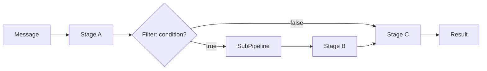

# @matteophre/dirama

[](https://github.com/matteoPhre/dirama/actions/workflows/ci.yml)
[](https://www.npmjs.com/package/@matteophre/dirama)
[](./LICENSE)

An asynchronous, compositional pipeline and conditional-stage orchestration engine written in TypeScript.

## The problem it solves

As a processing flow (validation, enrichment, side-effects, notifications, etc.) grows, imperative code with nested `if`/`else` quickly becomes hard to read, test, and extend. **@matteophre/dirama** provides a lightweight, dependency-free engine for composing this logic as a sequence of independent **stages** (`Stage`), executed in order on a shared **message** (`Message`), with the ability to run sub-pipelines only when a condition (**filter**) is met.

### Architecture: Pipeline / Stage / Filter / Message

- **`Message`** — the data that flows through the pipeline. It must implement the minimal `IBaseMessage` contract (`getExit`/`setExit`), used by the engine to handle early exit; the rest of the message shape is up to the consumer.
- **`Stage`** — the elementary unit of work (contract `IStage<T>`). It receives the current message, a `next` callback to invoke the following stage, and the `resolve`/`reject` callbacks to return control to the caller.
- **`Pipeline`** — orchestrates a sequence of `Stage`s, invoking them in order and handling early exit when a message sets the `exit` flag.
- **`Filter`** (`PipelineFilter`) — a special `Stage` that evaluates a predicate (`IMatchCallback`) on the message: if the predicate is true, it runs a nested sub-pipeline (`SubPipeline`) of stages; otherwise it passes control directly to the next stage.
- **`Task`** (`PipelineTask`) — the most common "leaf" `Stage`: it wraps a simple asynchronous callback (`IExecuteCallback`) that acts on the message.
- **`ExecutionContext`** — an optional, strongly-typed `Message` implementation that carries a mutable `TState` payload plus baseline `IExecutionMetadata` (`requestId`, `timestamp`) across stages, without requiring type assertions (`as`).



## Table of Contents

- [System requirements](#system-requirements)
- [Installation](#installation)
- [Usage example](#usage-example)
- [Architecture & Core Concepts](#architecture--core-concepts)
  - [Defining a Message](#defining-a-message)
  - [Defining a custom Stage](#defining-a-custom-stage)
  - [Defining a conditional filter](#defining-a-conditional-filter)
  - [Using ExecutionContext for typed state](#using-executioncontext-for-typed-state)
  - [Observability hooks](#observability-hooks)
- [Available scripts](#available-scripts)
- [License](#license)

## System requirements

- Node.js >= 18 (Node 20 LTS recommended)
- A TypeScript project configured for **ESM** (`"type": "module"` in `package.json`)

## Installation

With npm:

```bash
npm install @matteophre/dirama
```

With pnpm:

```bash
pnpm add @matteophre/dirama
```

With yarn:

```bash
yarn add @matteophre/dirama
```

## Usage example

```typescript
import {
  Pipeline,
  PipelineTask,
  PipelineFilter,
  IBaseMessage,
} from "@matteophre/dirama";

// 1. The message that flows through the pipeline.
class OrderMessage implements IBaseMessage {
  private exit = false;

  public total: number;
  public isPremiumCustomer: boolean;
  public discountApplied = false;

  constructor(total: number, isPremiumCustomer: boolean) {
    this.total = total;
    this.isPremiumCustomer = isPremiumCustomer;
  }

  public setExit(value: boolean): void {
    this.exit = value;
  }

  public getExit(): boolean {
    return this.exit;
  }
}

// 2. An unconditional stage: applies taxes.
const applyTaxes = new PipelineTask<OrderMessage>((message, resolve) => {
  message.total *= 1.22;
  resolve(message);
}, "apply-taxes");

// 3. A conditional filter: applies the discount only to premium customers.
const premiumDiscountFilter = new PipelineFilter<OrderMessage>(
  (message) => message.isPremiumCustomer,
  "premium-discount",
);

premiumDiscountFilter.pipe(
  new PipelineTask<OrderMessage>((message, resolve) => {
    message.total *= 0.9;
    message.discountApplied = true;
    resolve(message);
  }, "apply-discount"),
);

// 4. Composing the pipeline.
const orderPipeline = new Pipeline<OrderMessage>();
orderPipeline.pipes([premiumDiscountFilter, applyTaxes]);

const result = await orderPipeline.run(new OrderMessage(100, true));

console.log(result.total); // 99 * 1.22 = 120.78
console.log(result.discountApplied); // true
```

## Architecture & Core Concepts

### Defining a Message

Any class or object implementing `IBaseMessage` can flow through a `Pipeline`. The engine relies exclusively on `getExit`/`setExit` to decide whether to stop executing the following stages; the rest of the data (domain properties) is entirely up to you.

```typescript
import { IBaseMessage } from "@matteophre/dirama";

class MyMessage implements IBaseMessage {
  private exit = false;

  public setExit(value: boolean): void {
    this.exit = value;
  }

  public getExit(): boolean {
    return this.exit;
  }
}
```

### Defining a custom Stage

For reusable logic it is recommended to extend `BasePipelineStage`, implementing `executePipelineStep` and obtaining the corresponding `PipelineTask` via `getPipelineTask`:

```typescript
import { BasePipelineStage, IBaseMessage } from "@matteophre/dirama";

class LogStage<T extends IBaseMessage> extends BasePipelineStage<T> {
  protected async executePipelineStep(
    message: T,
    resolve: (output?: T | PromiseLike<T>) => void,
  ): Promise<void> {
    console.log("Processing message:", message);
    resolve(message);
  }
}

pipeline.pipe(new LogStage<OrderMessage>().getPipelineTask("log"));
```

### Defining a conditional filter

For a stage that should run only when a condition is true, extend `BaseConditionalPipelineStage` by implementing the `matchCallback` predicate and the logic in `executePipelineStep`, then obtain the `PipelineFilter` with `getPipelineFilter`:

```typescript
import {
  BaseConditionalPipelineStage,
  IMatchCallback,
} from "@matteophre/dirama";

class PremiumDiscountStage extends BaseConditionalPipelineStage<OrderMessage> {
  protected matchCallback: IMatchCallback<OrderMessage> = (message) =>
    message.isPremiumCustomer;

  protected async executePipelineStep(
    message: OrderMessage,
    resolve: (output?: OrderMessage | PromiseLike<OrderMessage>) => void,
  ): Promise<void> {
    message.total *= 0.9;
    resolve(message);
  }
}

pipeline.pipe(
  new PremiumDiscountStage().getPipelineFilter("premium-discount"),
);
```

A stage piped onto a `PipelineFilter` is executed only if the predicate returns `true`; otherwise the filter is a no-op and control passes directly to the next stage of the main pipeline.

### Using ExecutionContext for typed state

When a plain `IBaseMessage` implementation is not enough — for example, when several stages need to read and mutate a shared, strongly-typed payload — use `ExecutionContext<TState, TMetadata>` instead of a hand-rolled message class. It implements `IBaseMessage` itself, so it can flow through a `Pipeline` unchanged, and it exposes `getState`/`setState`/`setStateValue` to mutate the payload immutably without ever needing an `as` assertion. Every instance also carries baseline metadata (`requestId`, `timestamp`), optionally extended with your own fields:

```typescript
import { ExecutionContext, Pipeline, PipelineTask } from "@matteophre/dirama";

interface OrderState {
  total: number;
  items: string[];
}

interface OrderMetadata {
  tenantId: string;
}

const addTax = new PipelineTask<ExecutionContext<OrderState, OrderMetadata>>(
  (ctx, resolve) => {
    ctx.setState({ total: ctx.getState().total * 1.22 });
    resolve(ctx);
  },
  "add-tax",
);

const pipeline = new Pipeline<ExecutionContext<OrderState, OrderMetadata>>();
pipeline.pipe(addTax);

const context = new ExecutionContext<OrderState, OrderMetadata>(
  { total: 100, items: ["sku-1"] },
  { tenantId: "tenant-1" },
);

const result = await pipeline.run(context);

console.log(result.getState().total); // 122
console.log(result.metadata.requestId); // unique per-run identifier
```

### Observability hooks

`Pipeline` and `PipelineFilter` optionally accept an `IPipelineHooks` object to observe execution without altering the engine's logic:

```typescript
const pipeline = new Pipeline<OrderMessage>({
  onStageStart: (stage, input) => console.log(`> ${stage.name}`, input),
  onStageEnd: (stage, output) => console.log(`< ${stage.name}`, output),
  onError: (stage, error) => console.error(`! ${stage?.name}`, error),
});
```

## Available scripts

| Script | Command | Description |
| --- | --- | --- |
| `build` | `tsc` | Compiles the TypeScript sources into `dist/`. |
| `test` | `vitest run` | Runs the test suite once. |
| `test:watch` | `vitest` | Runs the test suite in watch mode. |
| `lint` | `eslint .` | Lints the code with ESLint. |
| `type-check` | `tsc --noEmit` | Checks types without emitting output. |

## License

Distributed under the [MIT](./LICENSE) license.
